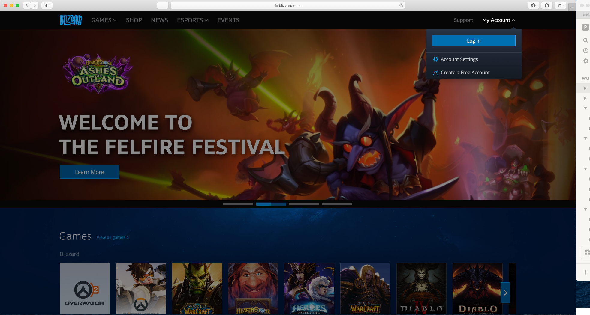
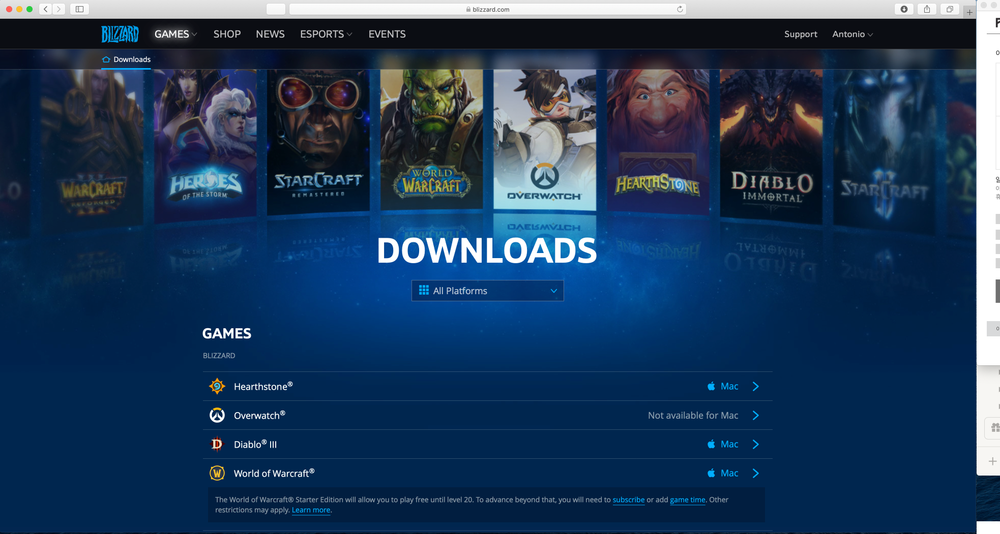
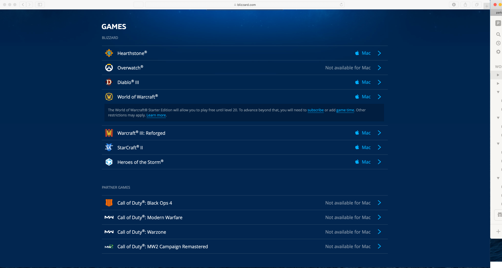
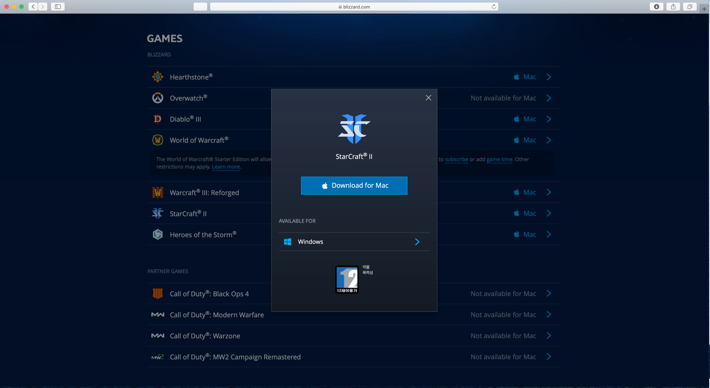
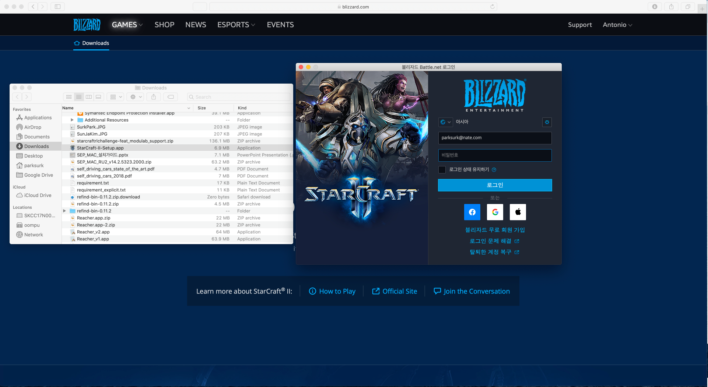
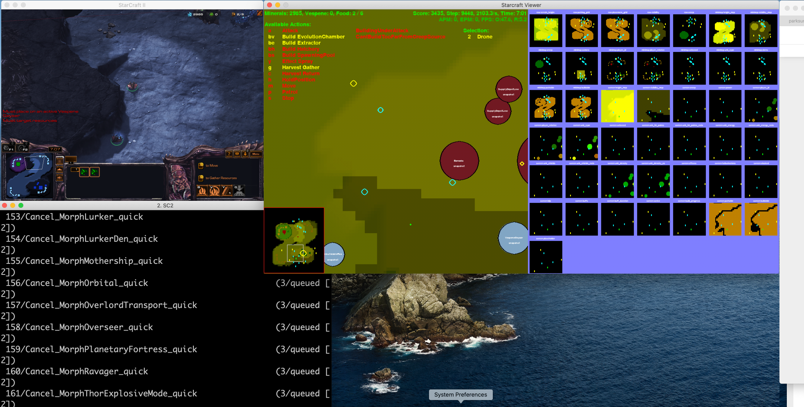

# PySC2 - StarCraft II Learning Environment Setup

## [Table of Contents]

1. Anaconda 설치 및 Python 가상 환경 설정 (Optional)
2. PySC2 설치
3. StarCraft II 설치
4. Map and Replay Packs 설치
5. 설치 확인 및 간단한 예제 실행

---

## [Installation list]

### Mandatory

- Python3
- StarCraft II
- PySC2

### Optional

- Anaconda

# 1. Anaconda 설치 및 Python 가상 환경 설정

- https://www.anaconda.com/distribution/
- Anaconda_Python_Virtual_Env_installation.md 를 참조하여 Python 설치 및 Python 가상 환경(가상환경 이름은 starcraft2 임)을 구성한다.

# 2. PySC2 설치

### 참고자료

- [https://github.com/deepmind/pysc2](https://github.com/deepmind/pysc2)

파이썬 가상환경 starcraft2 로 들어간다.
```
$ activate starcraft2
```
PySC2를 설치한다.
```
(starcraft2)$ pip install --upgrade pip
(starcraft2)$ pip install pysc2
```

# 3. StarCraft II 설치

### 참고자료

- [https://github.com/deepmind/pysc2#get-starcraft-ii](https://github.com/deepmind/pysc2#get-starcraft-ii)

## Linux 인 경우

- 리눅스 설치는  위 참고링크를 참조할 것. (대부분 리눅스 환경을 사용하지 않음.)

## Windows/MacOS 인 경우

- Battle.net 가입 - [https://battle.net/](https://battle.net/)



- StarCraft II 무료 체험판 -> 클라이언트 다운로드









- 기본 설치 경로는 일반적으로 다음과 같다.

```
Windows: C:\Program Files (x86)\StarCraft II\
Mac: /Applications/StarCraft II/
On Linux, the installation directory is the folder you extracted the linux package into.
```

# 4. Map and Replay Packs 설치

### 참고자료

- https://github.com/deepmind/pysc2#get-the-maps

스타2 기본 설치 디렉토리에 Maps라는 디렉토리를 만든다. 앞으로 이 디렉토리에 Map Pack과 미니게임들을 다운로드하여 압축을 풀어야 한다.

```
StarCraft II/Maps
```

### Map Pack 다운로드

- 다운로드 링크 - https://github.com/Blizzard/s2client-proto#downloads
- 해당 링크에서 필요한 Map Pack 을 다운로드 받는다 .
- 이 팩들은 압축을 풀 때 암호를 물어본다.
    - 패스워드 : ‘iagreetotheeula’
    - (참고) https://github.com/Blizzard/s2client-proto#downloads
- 기타 다른 맵들은 아래 링크 참고
    - (참고) https://github.com/Blizzard/s2client-proto#map-packs

### Mini Games 다운로드

- 다운로드 링크 - https://github.com/deepmind/pysc2/releases/download/v1.2/mini_games.zip

# 5. 설치 확인 및 간단한 예제 실행

### List the maps

파이썬 가상환경 starcraft2 로 들어간다.
```
$ activate starcraft2
```

Starcraft 설치가 정상적으로 되었는지 예제를 실행하여 체크한다.
```
(starcraft2)$ python -m pysc2.bin.map_list
```

```
16Bit
    Ladder2018Season2/(2)16-BitLE.SC2Map
    players: 2, score_index: -1, score_multiplier: 1
    step_mul: 8, game_steps_per_episode: 28800

Abiogenesis
    Ladder2018Season1/AbiogenesisLE.SC2Map
    players: 2, score_index: -1, score_multiplier: 1
    step_mul: 8, game_steps_per_episode: 28800

AbyssalReef
    Ladder2017Season4/AbyssalReefLE.SC2Map
    players: 2, score_index: -1, score_multiplier: 1
    step_mul: 8, game_steps_per_episode: 28800

AcidPlant
    Ladder2018Season3/AcidPlantLE.SC2Map
    players: 2, score_index: -1, score_multiplier: 1
    step_mul: 8, game_steps_per_episode: 28800

Acolyte
    Ladder2017Season3/AcolyteLE.SC2Map
    players: 2, score_index: -1, score_multiplier: 1
    step_mul: 8, game_steps_per_episode: 28800

AscensiontoAiur
    Ladder2017Season4/AscensiontoAiurLE.SC2Map
    players: 2, score_index: -1, score_multiplier: 1
    step_mul: 8, game_steps_per_episode: 28800

Automaton
    Ladder2019Season1/AutomatonLE.SC2Map
    players: 2, score_index: -1, score_multiplier: 1
    step_mul: 8, game_steps_per_episode: 28800

Backwater
    Ladder2018Season1/BackwaterLE.SC2Map
    players: 2, score_index: -1, score_multiplier: 1
    step_mul: 8, game_steps_per_episode: 28800

BattleontheBoardwalk
    Ladder2017Season4/BattleontheBoardwalkLE.SC2Map
    players: 2, score_index: -1, score_multiplier: 1
    step_mul: 8, game_steps_per_episode: 28800

BelShirVestige
    Ladder2017Season1/BelShirVestigeLE.SC2Map
    players: 2, score_index: -1, score_multiplier: 1
    step_mul: 8, game_steps_per_episode: 28800

Blackpink
    Ladder2018Season1/BlackpinkLE.SC2Map
    players: 2, score_index: -1, score_multiplier: 1
    step_mul: 8, game_steps_per_episode: 28800

BloodBoil
    Ladder2017Season2/BloodBoilLE.SC2Map
    players: 2, score_index: -1, score_multiplier: 1
    step_mul: 8, game_steps_per_episode: 28800

Blueshift
    Ladder2018Season4/BlueshiftLE.SC2Map
    players: 2, score_index: -1, score_multiplier: 1
    step_mul: 8, game_steps_per_episode: 28800

BuildMarines
    mini_games/BuildMarines.SC2Map
    players: 1, score_index: 0, score_multiplier: 1
    step_mul: 8, game_steps_per_episode: 0

CactusValley
    Ladder2017Season1/CactusValleyLE.SC2Map
    players: 4, score_index: -1, score_multiplier: 1
    step_mul: 8, game_steps_per_episode: 28800

Catalyst
    Ladder2018Season2/(2)CatalystLE.SC2Map
    players: 2, score_index: -1, score_multiplier: 1
    step_mul: 8, game_steps_per_episode: 28800

CeruleanFall
    Ladder2018Season4/CeruleanFallLE.SC2Map
    players: 2, score_index: -1, score_multiplier: 1
    step_mul: 8, game_steps_per_episode: 28800

CollectMineralShards
    mini_games/CollectMineralShards.SC2Map
    players: 1, score_index: 0, score_multiplier: 1
    step_mul: 8, game_steps_per_episode: 0

CollectMineralsAndGas
    mini_games/CollectMineralsAndGas.SC2Map
    players: 1, score_index: 0, score_multiplier: 1
    step_mul: 8, game_steps_per_episode: 0

CyberForest
    Ladder2019Season1/CyberForestLE.SC2Map
    players: 2, score_index: -1, score_multiplier: 1
    step_mul: 8, game_steps_per_episode: 28800

DarknessSanctuary
    Ladder2018Season2/(4)DarknessSanctuaryLE.SC2Map
    players: 4, score_index: -1, score_multiplier: 1
    step_mul: 8, game_steps_per_episode: 28800

DefeatRoaches
    mini_games/DefeatRoaches.SC2Map
    players: 1, score_index: 0, score_multiplier: 1
    step_mul: 8, game_steps_per_episode: 0

DefeatZerglingsAndBanelings
    mini_games/DefeatZerglingsAndBanelings.SC2Map
    players: 1, score_index: 0, score_multiplier: 1
    step_mul: 8, game_steps_per_episode: 0

DefendersLanding
    Ladder2017Season2/DefendersLandingLE.SC2Map
    players: 2, score_index: -1, score_multiplier: 1
    step_mul: 8, game_steps_per_episode: 28800

Dreamcatcher
    Ladder2018Season3/DreamcatcherLE.SC2Map
    players: 2, score_index: -1, score_multiplier: 1
    step_mul: 8, game_steps_per_episode: 28800

Eastwatch
    Ladder2018Season1/EastwatchLE.SC2Map
    players: 2, score_index: -1, score_multiplier: 1
    step_mul: 8, game_steps_per_episode: 28800

FindAndDefeatZerglings
    mini_games/FindAndDefeatZerglings.SC2Map
    players: 1, score_index: 0, score_multiplier: 1
    step_mul: 8, game_steps_per_episode: 0

Flat128
    Melee/Flat128.SC2Map
    players: 2, score_index: -1, score_multiplier: 1
    step_mul: 8, game_steps_per_episode: 28800

Flat32
    Melee/Flat32.SC2Map
    players: 2, score_index: -1, score_multiplier: 1
    step_mul: 8, game_steps_per_episode: 28800

Flat48
    Melee/Flat48.SC2Map
    players: 2, score_index: -1, score_multiplier: 1
    step_mul: 8, game_steps_per_episode: 28800

Flat64
    Melee/Flat64.SC2Map
    players: 2, score_index: -1, score_multiplier: 1
    step_mul: 8, game_steps_per_episode: 28800

Flat96
    Melee/Flat96.SC2Map
    players: 2, score_index: -1, score_multiplier: 1
    step_mul: 8, game_steps_per_episode: 28800

Fracture
    Ladder2018Season3/FractureLE.SC2Map
    players: 2, score_index: -1, score_multiplier: 1
    step_mul: 8, game_steps_per_episode: 28800

Frost
    Ladder2017Season3/FrostLE.SC2Map
    players: 2, score_index: -1, score_multiplier: 1
    step_mul: 8, game_steps_per_episode: 28800

Honorgrounds
    Ladder2017Season1/HonorgroundsLE.SC2Map
    players: 4, score_index: -1, score_multiplier: 1
    step_mul: 8, game_steps_per_episode: 28800

Interloper
    Ladder2017Season3/InterloperLE.SC2Map
    players: 2, score_index: -1, score_multiplier: 1
    step_mul: 8, game_steps_per_episode: 28800

KairosJunction
    Ladder2019Season1/KairosJunctionLE.SC2Map
    players: 2, score_index: -1, score_multiplier: 1
    step_mul: 8, game_steps_per_episode: 28800

KingsCove
    Ladder2019Season1/KingsCoveLE.SC2Map
    players: 2, score_index: -1, score_multiplier: 1
    step_mul: 8, game_steps_per_episode: 28800

LostandFound
    Ladder2018Season3/LostandFoundLE.SC2Map
    players: 2, score_index: -1, score_multiplier: 1
    step_mul: 8, game_steps_per_episode: 28800

MechDepot
    Ladder2017Season3/MechDepotLE.SC2Map
    players: 2, score_index: -1, score_multiplier: 1
    step_mul: 8, game_steps_per_episode: 28800

MoveToBeacon
    mini_games/MoveToBeacon.SC2Map
    players: 1, score_index: 0, score_multiplier: 1
    step_mul: 8, game_steps_per_episode: 0

NewRepugnancy
    Ladder2019Season1/NewRepugnancyLE.SC2Map
    players: 2, score_index: -1, score_multiplier: 1
    step_mul: 8, game_steps_per_episode: 28800

NewkirkPrecinct
    Ladder2017Season1/NewkirkPrecinctTE.SC2Map
    players: 2, score_index: -1, score_multiplier: 1
    step_mul: 8, game_steps_per_episode: 28800

Odyssey
    Ladder2017Season4/OdysseyLE.SC2Map
    players: 2, score_index: -1, score_multiplier: 1
    step_mul: 8, game_steps_per_episode: 28800

PaladinoTerminal
    Ladder2017Season1/PaladinoTerminalLE.SC2Map
    players: 2, score_index: -1, score_multiplier: 1
    step_mul: 8, game_steps_per_episode: 28800

ParaSite
    Ladder2018Season4/ParaSiteLE.SC2Map
    players: 2, score_index: -1, score_multiplier: 1
    step_mul: 8, game_steps_per_episode: 28800

PortAleksander
    Ladder2019Season1/PortAleksanderLE.SC2Map
    players: 2, score_index: -1, score_multiplier: 1
    step_mul: 8, game_steps_per_episode: 28800

ProximaStation
    Ladder2017Season2/ProximaStationLE.SC2Map
    players: 2, score_index: -1, score_multiplier: 1
    step_mul: 8, game_steps_per_episode: 28800

Redshift
    Ladder2018Season2/(2)RedshiftLE.SC2Map
    players: 2, score_index: -1, score_multiplier: 1
    step_mul: 8, game_steps_per_episode: 28800

Sequencer
    Ladder2017Season2/SequencerLE.SC2Map
    players: 2, score_index: -1, score_multiplier: 1
    step_mul: 8, game_steps_per_episode: 28800

Simple128
    Melee/Simple128.SC2Map
    players: 2, score_index: -1, score_multiplier: 1
    step_mul: 8, game_steps_per_episode: 28800

Simple64
    Melee/Simple64.SC2Map
    players: 2, score_index: -1, score_multiplier: 1
    step_mul: 8, game_steps_per_episode: 28800

Simple96
    Melee/Simple96.SC2Map
    players: 2, score_index: -1, score_multiplier: 1
    step_mul: 8, game_steps_per_episode: 28800

Stasis
    Ladder2018Season4/StasisLE.SC2Map
    players: 2, score_index: -1, score_multiplier: 1
    step_mul: 8, game_steps_per_episode: 28800

YearZero
    Ladder2019Season1/YearZeroLE.SC2Map
    players: 2, score_index: -1, score_multiplier: 1
    step_mul: 8, game_steps_per_episode: 28800
```

### Run an agent

You can run an agent to test the environment. The UI shows you the actions of the agent and is helpful for debugging and visualization purposes.

```
$ python -m pysc2.bin.agent --map Simple64
```



```
pygame 1.9.6
Hello from the pygame community. https://www.pygame.org/contribute.html
I0513 12:38:56.244645 4476237248 sc_process.py:110] Launching SC2: /Applications/StarCraft II/Versions/Base73620/SC2.app/Contents/MacOS/SC2 -listen 127.0.0.1 -port 19318 -dataDir /Applications/StarCraft II/ -tempDir /var/folders/bd/ly13_3254l11f2tvqcmxz6m80000gn/T/sc-8z_o1y42/ -displayMode 0 -windowwidth 640 -windowheight 480 -windowx 50 -windowy 50
I0513 12:38:56.281926 4476237248 remote_controller.py:163] Connecting to: ws://127.0.0.1:19318/sc2api, attempt: 0, running: True
I0513 12:38:57.291093 4476237248 remote_controller.py:163] Connecting to: ws://127.0.0.1:19318/sc2api, attempt: 1, running: True
I0513 12:38:58.294008 4476237248 remote_controller.py:163] Connecting to: ws://127.0.0.1:19318/sc2api, attempt: 2, running: True
I0513 12:38:59.294961 4476237248 remote_controller.py:163] Connecting to: ws://127.0.0.1:19318/sc2api, attempt: 3, running: True
I0513 12:39:00.295962 4476237248 remote_controller.py:163] Connecting to: ws://127.0.0.1:19318/sc2api, attempt: 4, running: True
err = 3 /opt/blizzard/buildserver/data.noindex/repositories/sc2/branches/SC2.4.8.d/Game/Contrib/macteam/libs/ClampCursor/Contrib/mach_override/mach_override.c:244
err = 3 /opt/blizzard/buildserver/data.noindex/repositories/sc2/branches/SC2.4.8.d/Game/Contrib/macteam/libs/ClampCursor/Contrib/mach_override/mach_override.c:258
err = 3 /opt/blizzard/buildserver/data.noindex/repositories/sc2/branches/SC2.4.8.d/Game/Contrib/macteam/libs/ClampCursor/Contrib/mach_override/mach_override.c:263
I0513 12:39:01.301659 4476237248 remote_controller.py:163] Connecting to: ws://127.0.0.1:19318/sc2api, attempt: 5, running: True
I0513 12:39:02.304540 4476237248 remote_controller.py:163] Connecting to: ws://127.0.0.1:19318/sc2api, attempt: 6, running: True
I0513 12:39:03.305200 4476237248 remote_controller.py:163] Connecting to: ws://127.0.0.1:19318/sc2api, attempt: 7, running: True
I0513 12:39:04.310729 4476237248 remote_controller.py:163] Connecting to: ws://127.0.0.1:19318/sc2api, attempt: 8, running: True
I0513 12:39:05.311653 4476237248 remote_controller.py:163] Connecting to: ws://127.0.0.1:19318/sc2api, attempt: 9, running: True
I0513 12:39:06.315705 4476237248 remote_controller.py:163] Connecting to: ws://127.0.0.1:19318/sc2api, attempt: 10, running: True
I0513 12:39:07.320570 4476237248 remote_controller.py:163] Connecting to: ws://127.0.0.1:19318/sc2api, attempt: 11, running: True
I0513 12:39:08.324279 4476237248 remote_controller.py:163] Connecting to: ws://127.0.0.1:19318/sc2api, attempt: 12, running: True
I0513 12:39:09.324954 4476237248 remote_controller.py:163] Connecting to: ws://127.0.0.1:19318/sc2api, attempt: 13, running: True
I0513 12:39:10.330213 4476237248 remote_controller.py:163] Connecting to: ws://127.0.0.1:19318/sc2api, attempt: 14, running: True
I0513 12:39:11.331466 4476237248 remote_controller.py:163] Connecting to: ws://127.0.0.1:19318/sc2api, attempt: 15, running: True
I0513 12:39:12.332440 4476237248 remote_controller.py:163] Connecting to: ws://127.0.0.1:19318/sc2api, attempt: 16, running: True
I0513 12:39:13.334718 4476237248 remote_controller.py:163] Connecting to: ws://127.0.0.1:19318/sc2api, attempt: 17, running: True
I0513 12:39:14.337866 4476237248 remote_controller.py:163] Connecting to: ws://127.0.0.1:19318/sc2api, attempt: 18, running: True
I0513 12:39:26.365386 4476237248 sc2_env.py:322] Environment is ready on map: Simple64
I0513 12:39:26.366323 4476237248 sc2_env.py:462] Starting episode: 1
   0/no_op                                              ()
   1/move_camera                                        (1/minimap [64, 64])
   2/select_point                                       (6/select_point_act [4]; 0/screen [84, 84])
   3/select_rect                                        (7/select_add [2]; 0/screen [84, 84]; 2/screen2 [84, 84])
   4/select_control_group                               (4/control_group_act [5]; 5/control_group_id [10])
   5/select_unit                                        (8/select_unit_act [4]; 9/select_unit_id [500])
 264/Harvest_Gather_screen                              (3/queued [2]; 0/screen [84, 84])
  12/Attack_screen                                      (3/queued [2]; 0/screen [84, 84])
  13/Attack_minimap                                     (3/queued [2]; 1/minimap [64, 64])
 274/HoldPosition_quick                                 (3/queued [2])
  40/Build_Assimilator_screen                           (3/queued [2]; 0/screen [84, 84])
  55/Build_Forge_screen                                 (3/queued [2]; 0/screen [84, 84])
  57/Build_Gateway_screen                               (3/queued [2]; 0/screen [84, 84])
  65/Build_Nexus_screen                                 (3/queued [2]; 0/screen [84, 84])
 453/Stop_quick                                         (3/queued [2])
  70/Build_Pylon_screen                                 (3/queued [2]; 0/screen [84, 84])
 331/Move_screen                                        (3/queued [2]; 0/screen [84, 84])
 332/Move_minimap                                       (3/queued [2]; 1/minimap [64, 64])
 333/Patrol_screen                                      (3/queued [2]; 0/screen [84, 84])
 334/Patrol_minimap                                     (3/queued [2]; 1/minimap [64, 64])
 230/Effect_Spray_screen                                (3/queued [2]; 0/screen [84, 84])
 269/Harvest_Return_quick                               (3/queued [2])
   6/select_idle_worker                                 (10/select_worker [4])
 485/Train_Probe_quick                                  (3/queued [2])
 527/Effect_ChronoBoostEnergyCost_screen                (3/queued [2]; 0/screen [84, 84])
 208/Effect_MassRecall_screen                           (3/queued [2]; 0/screen [84, 84])
 343/Rally_Workers_screen                               (3/queued [2]; 0/screen [84, 84])
 344/Rally_Workers_minimap                              (3/queued [2]; 1/minimap [64, 64])
 168/Cancel_Last_quick                                  (3/queued [2])
  11/build_queue                                        (11/build_queue_id [10])
I0513 12:40:09.009577 4476237248 sc2_env.py:632] Episode 1 finished after 13624 game steps. Outcome: [-1], reward: [-1], score: [2515]
I0513 12:40:13.933825 4476237248 sc2_env.py:462] Starting episode: 2
  50/Build_EngineeringBay_screen                        (3/queued [2]; 0/screen [84, 84])
  79/Build_Refinery_screen                              (3/queued [2]; 0/screen [84, 84])
  91/Build_SupplyDepot_screen                           (3/queued [2]; 0/screen [84, 84])
 220/Effect_Repair_screen                               (3/queued [2]; 0/screen [84, 84])
 221/Effect_Repair_autocast                             ()
  44/Build_CommandCenter_screen                         (3/queued [2]; 0/screen [84, 84])
 261/Halt_quick                                         (3/queued [2])
 140/Cancel_quick                                       (3/queued [2])
 294/LoadAll_quick                                      (3/queued [2])
 490/Train_SCV_quick                                    (3/queued [2])
 281/Lift_quick                                         (3/queued [2])
 275/Land_screen                                        (3/queued [2]; 0/screen [84, 84])
  10/unload                                             (12/unload_id [500])
 511/UnloadAll_quick                                    (3/queued [2])
I0513 12:40:41.482563 4476237248 sc2_env.py:632] Episode 2 finished after 9912 game steps. Outcome: [-1], reward: [-1], score: [1525]
I0513 12:40:45.874586 4476237248 sc2_env.py:462] Starting episode: 3
  51/Build_EvolutionChamber_screen                      (3/queued [2]; 0/screen [84, 84])
  52/Build_Extractor_screen                             (3/queued [2]; 0/screen [84, 84])
  59/Build_Hatchery_screen                              (3/queued [2]; 0/screen [84, 84])
  84/Build_SpawningPool_screen                          (3/queued [2]; 0/screen [84, 84])
^C
Took 84.338 seconds for 3250 steps: 38.536 fps
```

---

# Reference

- StarCraft II Learning Environment - https://github.com/deepmind/pysc2
